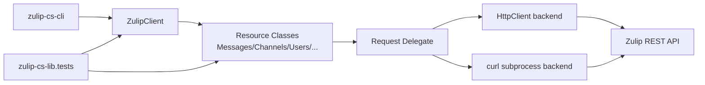

# Architecture Overview

## Solution Structure

The solution contains three projects:

- `zulip-cs-lib` (class library): primary Zulip REST API wrapper.
- `zulip-cs-cli` (console app): command-line interface built on top of the library.
- `zulip-cs-lib.tests` (test project): automated tests for library and client behavior.

All projects multi-target: `net8.0;net9.0;net10.0`.

## High-Level Component Diagram

## Core Design Patterns

### 1. Request Delegate Pattern

`ZulipClient` initializes resource classes with a shared delegate:

- Signature: `Func<HttpMethod, string, Dictionary<string, string>, Task<ZulipResponse>>`
- Effect: resource classes stay transport-agnostic.
- Benefit: easy testability and dual transport support (`HttpClient` and `curl`).

### 2. Throwing + Try Method Pairing

Most API operations expose two variants:

- Throwing variant (e.g., `SendStream`, `GetAll`, `Create`).
- Non-throwing `Try` variant (e.g., `TrySendStream`, `TryGetAll`, `TryCreate`) returning tuples.

This supports both strict exception flow and explicit caller-managed failure handling.

### 3. Central Response Envelope

`ZulipResponse` acts as a common deserialization target and transport metadata carrier.

- API payload fields map via `JsonPropertyName`.
- Local diagnostic fields (`Success`, `CaughtException`, `HttpResponseCode`, etc.) are ignored from JSON.

## Authentication and Client Initialization

`ZulipClient` supports:

- Site/email/API key constructor.
- `zuliprc`-based constructor.
- Optional custom `HttpClient`.
- Optional `curl` command path backend.

Authentication uses Basic auth header from `email:api_key` for API calls.

## CLI Integration Boundary

The CLI is intentionally thin:

- Parses args with `System.CommandLine`.
- Resolves config (`--zuliprc` or discovery).
- Invokes `Try*` methods on `zulip-cs-lib` resources.
- Prints plain result messages or JSON payloads.

## Test Strategy

`zulip-cs-lib.tests` validates:

- `ZulipClient` transport and parsing behaviors.
- Resource method request/response semantics.
- INI parsing edge cases.

Tests use `Moq` and mocked `HttpMessageHandler` to avoid real network dependency in unit coverage.

---
Generated on: 2026-03-05  
Published version: 0.0.1-beta.1
