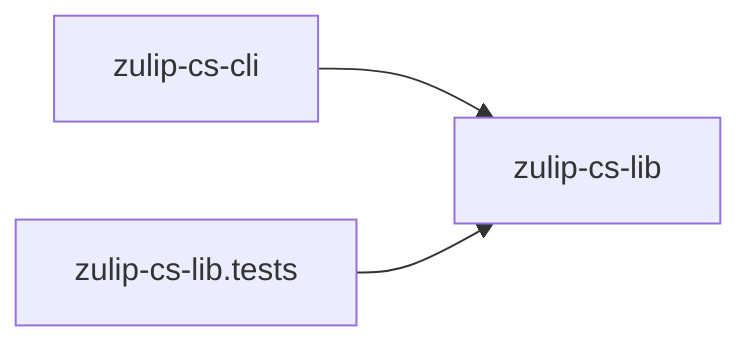

# Dependencies and Build/Test Reference

## Target Frameworks and Language

All projects target:

- `net8.0`
- `net9.0`
- `net10.0`

Language version:

- C# `14`

## Project Dependency Graph



## NuGet Dependencies

### `zulip-cs-lib`

- No explicit external NuGet package dependencies.
- Uses .NET BCL APIs including `System.Net.Http` and `System.Text.Json`.

### `zulip-cs-cli`

- `System.CommandLine` `2.0.0-beta4.22272.1`

### `zulip-cs-lib.tests`

- `Microsoft.NET.Test.Sdk` `18.3.0`
- `Moq` `4.20.72`
- `xunit` `2.9.3`
- `xunit.runner.visualstudio` `3.1.5`
- `coverlet.collector` `8.0.0`

## Version Information in Source

Current project file versions found in source:

- `zulip-cs-lib`: `0.0.1-beta.2`
- `zulip-cs-cli`: `0.0.1-beta.2`
- `zulip-cs-lib.tests`: `0.0.1-alpha.5`

Note: documentation footers in this set intentionally use the requested published version `0.0.1-beta.1`.

## Build and Test Commands

Run from `src/`:

```bash
dotnet restore
dotnet build
dotnet test
```

Single test class:

```bash
dotnet test --filter "FullyQualifiedName~zulip_set_lib.tests.IniParserTests"
```

Single fully-qualified test:

```bash
dotnet test --filter "FullyQualifiedName=zulip_set_lib.tests.MessageTests.Message_SendPrivate_EmailSingle"
```

## Runtime and Environment Notes

- CLI requires a valid `zuliprc` file unless custom client construction is used in code.
- Library supports both managed `HttpClient` transport and external `curl` subprocess transport.
- For `curl` backend usage, ensure the executable path is available and accessible.

---
Generated on: 2026-03-05  
Published version: 0.0.1-beta.1
