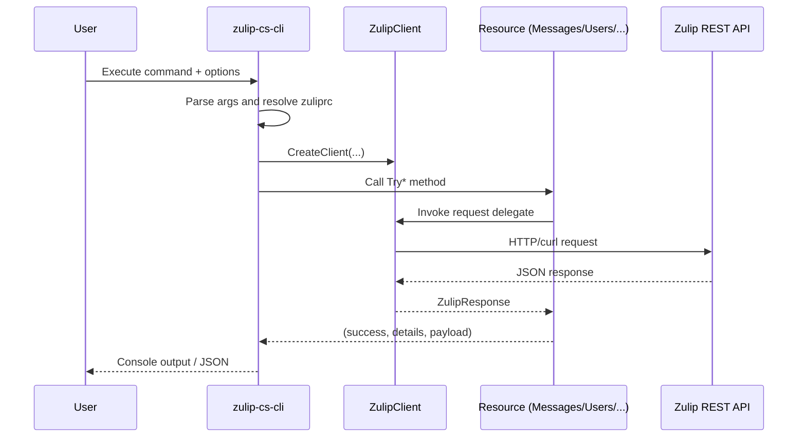
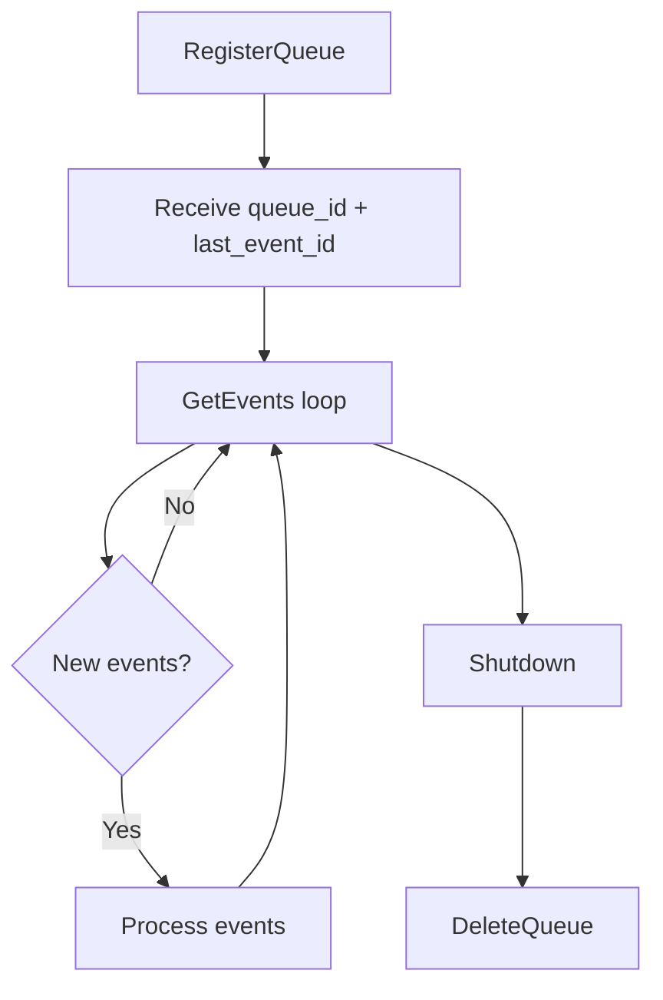

# Process Flows

This document summarizes key execution and interaction flows in `zulip-cs`.

## 1. CLI Command Execution Flow

## 2. Message Send Flow (`Messages.Send*` / `TrySend*`)

1. Caller passes content + recipients (private or stream).
2. Resource validates or structures payload fields (`type`, `to`, `topic`, `content`).
3. Resource sends `POST /api/v1/messages` through delegate.
4. Response is parsed into `ZulipResponse`.
5. Method returns `messageId` (or tuple with failure details).

## 3. Message Retrieval Flow (`Messages.Get`)

1. Caller chooses anchor mode (`Newest`, `Oldest`, `FirstUnread`, `Id`).
2. Optional narrow filters are serialized using `Narrow.ToJsonArray(...)`.
3. Resource issues `GET /api/v1/messages` with `num_before`/`num_after`.
4. Results are returned as `List<MessageObject>` plus anchor boundary metadata in the response envelope.

## 4. Event Queue Lifecycle (`Events`)

Recommended practice: always call `DeleteQueue` on shutdown to clean up server-side queue resources.

## 5. Configuration Discovery Flow (`FindZulipRC`)

1. Start at executable base directory.
2. Check `zuliprc` in current directory.
3. Check `secrets/zuliprc` in current directory.
4. Move to parent directory and repeat.
5. Stop at root and throw if no config found.

## 6. Transport Selection Flow

`ZulipClient` binds resources to one transport delegate at construction time:

- `DoZulipRequestHttpClient` when using default/custom `HttpClient`.
- `DoZulipRequestCurl` when using curl backend.

Both return `ZulipResponse`, so resource behavior remains consistent independent of transport.

---
Generated on: 2026-03-05  
Published version: 0.0.1-beta.1
